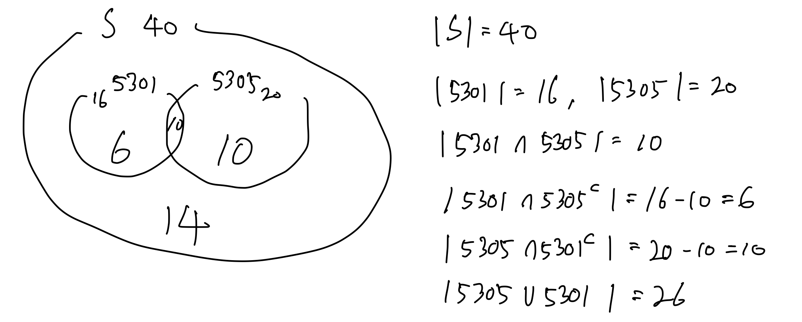

$$
\begin{array}{c}
\huge{\text{Homework #1}} \\
\hline
\text{Wonjun Park} \\
\text{UTA ID: 1002237177} \\
\href{mailto:wxp7177@mavs.uta.edu}{\text{wxp7177@mavs.uta.edu}}
\end{array}
$$

##### 1. Our sample space has 40 students, out of them 16 students took CSE-5301 course and 20 took CSE-5305 course. We know that 10 students are in both classes, based on these information answer the following questions and show the Venn diagram for each one: (7 points each)

a) how many students are in ether classes? \
$\qquad |\text{5301} \cup \text{5305}| = 26$ \
b) how many students are in neither classes? \
$\qquad |S| - |\text{5301} \cup \text{5305}| = 40 - 26 = 14$ \
c) If we randomly select a student, calculate the probability that the chosen student is taking only CSE-5305 \
$\qquad$ Let $P_{1.c}$ be the target probability. \
$\qquad P_{1.c} = \frac{|\text{5305} \cap \text{5301}^c|}{|S|} = \frac{20 - 10}{40} = \frac{10}{40} = 0.25$

##### 2.  Suppose we have a fair coin and we toss it 5 times: (5 points each)

a) Write down the sample space. \
$\qquad S = \{HHHHH, HHHHT, HHHTH, HHTHH, HTHHH, THHHH, HHHTT, HHTHT, HTHHT, THHHT, HHTTH, HTHTH,\\ \qquad\qquad THHTH, HTTHH, THTHH, TTHHH, HHTTT, HTHTT, HTTHT, HTTTH, THHTT, THTHT, THTTH, TTHHT, TTHTH,\\ \qquad\qquad TTTHH, HTTTT, THTTT, TTHTT, TTTHT, TTTTH, TTTTT\}$ \
b) What is the probability of getting exactly 3 heads and 2 tails? \
$\qquad$ The number of ways to get 3 heads and 2 tails is equal to the number of ways to choose 3 heads from 5 sequential tosses which $\qquad$is $_5 C_3 = 10$. And let $P_{2.b}$ be the targeted probability. \
$\qquad$ Therefore, $P_{2.b} = \frac{10}{2^5} = \frac{10}{32} = 0.3125$ \
c) What is the probability of getting at least 3 head? \
$\qquad$ The number of ways to get at least 3 heads is equal to the number of ways to choose 3 heads from 5 sequential tosses which $\qquad$is $_5 C_3 = 10$, 4 heads from 5 sequential tosses which is $_5 C_4 = 5$, and 5 heads from 5 sequential tosses which is $_5 C_5 = 1$. And let $\qquad$$P_{2.c}$ be the targeted probability. \
$\qquad$ As a result, $P_{2.c} = \frac{10 + 5 + 1}{2^5} = \frac{16}{32} = 0.5$

##### 3. Write down the sample space for each one of the following statements? (7.5 points each)

a) We have a bag containing white and black balls (number of balls are infinite). we keep drawing the balls until we see two white balls (or black balls) in consecutive draw. \
$\qquad$ Let $W$ be the white ball and $B$ be the black ball. \
$\qquad$ The sample space is infinite if $W$ is drawn in the odd order and $B$ is drawn in the even order. \
$\qquad$ Vice versa, the sample space is infinite if $B$ is drawn in the odd order and $W$ is drawn in the even order. \
$\qquad$ But the last two orders are $WW$ or $BB$ in all cases of the sample space. \
$\qquad$ Hence, the sample space is $\{WW, BB, BWW, WBB, WBWW, BWBB, WBWBB, BWBWW, \cdots\}$ \
b) We have a bag containing 6  balls (numbered from 1 to 6) we choose 3 balls and save the order of the numbers (calculate the number of items in the sample space, then write down a few example of them). \
$\qquad$ The number of items in the sample space is $_6 P_3 = 120$. \
$\qquad$ A few examples are $(1, 2, 3), (1, 2, 4), (1, 2, 5), (1, 2, 6), (1, 3, 4), (1, 3, 5), (1, 3, 6), (1, 4, 5), (1, 4, 6), (1, 5, 6) \cdots$ and so on.

##### 4. There are three rooms in a house: the kitchen, the bedroom and the living room. There is a radio transmitter outside the home that can be received in each room. A user is wearing a device that can measure the strength of the signal; however, due to noise in the sensor and in the environment, each time the device reads the signal strength, the result may contain an error. Someone has made a lot of measurements and created the following table representing the probability distribution for a given reading is in a particular room (P(Reading|Room)):

$$
\begin{array}{|c|c|c|c|c|c|c|}
\hline
\text{Room\Reading} & \le 49 & 50 & 51 & 52 & 53 & 54 \le \\
\hline
\text{Bedroom} & 0.33 & 0.45 & 0.12 & 0.1 & 0.05 & 0.02 \\
\hline
\text{Kitchen} & 0.07 & 0.15 & 0.53 & 0.14 & 0.08 & 0.05 \\
\hline
\text{Living Room} & 0.06 & 0.05 & 0.13 & 0.25 & 0.32 & 0.1 \\
\hline
\end{array}
$$

What are the probabilities (that we are inside) for each room given that we obtain a reading of 52 (and assuming that we spend about equal amounts of time in each room – i.e., that the sample comes equally likely from any of the three rooms)? (20 points) hint: you need to calculate P(each room | reading = 52) \
$\qquad$ The problem asked to calculate three probabilities:

$$
\text{i. } P(\text{Bedroom}|\text{Reading} = 52) \\
\text{ii. } P(\text{Kitchen}|\text{Reading} = 52) \\
\text{iii. } P(\text{Living Room}|\text{Reading} = 52)
$$

$\qquad$ From the table, the following probabilities are given:

$$
P(\text{Reading} = 52|\text{Bedroom}) = 0.1 \\
P(\text{Reading} = 52|\text{Kitchen}) = 0.14 \\
P(\text{Reading} = 52|\text{Living Room}) = 0.25 \\
$$

$\qquad$ Since the sample comes equally likely from any of the three rooms, $P(\text{Bedroom}) = P(\text{Kitchen}) = P(\text{Living Room}) = \frac{1}{3}$. \
$\qquad$ With these probabilities, the probability of getting a reading of 52 is:

$$
\begin{array}{ccc}
P(\text{Reading} = 52) & = & P(\text{Reading} = 52|\text{Bedroom}) \cdot P(\text{Bedroom}) \\
& & + P(\text{Reading} = 52|\text{Kitchen}) \cdot P(\text{Kitchen}) \\
& & + P(\text{Reading} = 52|\text{Living Room}) \cdot P(\text{Living Room}) \\
& = & 0.1 \times \frac{1}{3} + 0.14 \times \frac{1}{3} + 0.25 \times \frac{1}{3} \\
& = & \frac{49}{300}
\end{array}
$$

$\qquad$ Using the Bayes' theorem, we can calculate the probabilities:

$$
\begin{array}{ccccccc}
\text{i. } P(\text{Bedroom}|\text{Reading} = 52) & = & \frac{P(\text{Reading} = 52|\text{Bedroom}) \cdot P(\text{Bedroom})}{P(\text{Reading} = 52)} & = & \frac{0.1 \cdot \frac{1}{3}}{\frac{49}{300}} & = & \frac{10}{49} \\
\text{ii. } P(\text{Kitchen}|\text{Reading} = 52) & = & \frac{P(\text{Reading} = 52|\text{Kitchen}) \cdot P(\text{Kitchen})}{P(\text{Reading} = 52)} & = & \frac{0.14 \cdot \frac{1}{3}}{\frac{49}{300}} & = & \frac{2}{7} \\
\text{iii. } P(\text{Living Room}|\text{Reading} = 52) & = & \frac{P(\text{Reading} = 52|\text{Living Room}) \cdot P(\text{Living Room})}{P(\text{Reading} = 52)} & = & \frac{0.25 \cdot \frac{1}{3}}{\frac{49}{300}} & = & \frac{25}{49} \\
\end{array}
$$

##### 5. There is a rare disease, probability of someone getting the disease is  P(D) = 0.0001. If you have the disease, it will kill you ( P(K|D) = 1 ).

a. There is a test for that disease but it is not always correct means if you have the disease, the test will be positive in 95% of the times ( P(T|D) = 0.95)) and negative in 5% of the times ( P(~T|D) = 0.05). Also if you do not have the disease, the test might comes positive : P(T|~D) = 0.01 so we can say P(~T|~D) = 0.99

* Now you took the test and it came back positive, what is the probability that you actually have the disease? (P(D|T) = ?) (15 point)

$\qquad$ Before calculating $P(D|T)$, the probability $P(T)$ is needed:

$$
\begin{array}{ccc}
P(T) & = & P(T|D) \cdot P(D) + P(T|\lnot D) \cdot P(\lnot D) \\
& = & 0.95 \times 0.0001 + 0.01 \times 0.9999 \\
& = & 0.010094
\end{array}
$$

$\qquad$ Therefore,

$$
P(D|T) = \frac{P(T|D) \cdot P(D)}{P(T)} = \frac{0.95 \times 0.0001}{0.010094} = \frac{95}{10094}
$$

* what this value says about the reliability of the test? (4 points)

$\qquad$ Although the probability of actually having disease when the test came back positive is 0.94%, the test is still reliable because $\qquad$the reason that the $P(D|T)$ becomes low is that the number of those who have the disease is very low. Specifically, the imbalance $\qquad$between the number of those who have the disease and those who do not have the disease makes the test seems unreliable.

$\qquad$ However, in order to determine whether the test is reliable or not, the probabilities $P(T|D)$ and $P(\lnot T|\lnot D)$ is so important that the $\qquad$test is still reliable.

b. There is a cure for this disease (we show it by c) but the cure itself might kill you means if you have the disease or not, if you use the cure, it will kill you with the probability of 5% ( means P(K|C,D) = P(K|C,~D) = 0.05) so P(~K|C,D) = 0.95).

* so if the test came back positive, should you get the cure? hint : you need to compare these two values P(K|T,~C) vs P(K|T,C) then explain your decision) (10 points)

$\qquad$ To decide if I get the cure, the comparison between $P(K|T,\lnot C)$ and $P(K|T,C)$ is required.

$$
( \mathit{P(\lnot D|T)} = \frac{P(T|\lnot D) \cdot P(\lnot D)}{P(T)} = \frac{9999}{10094} ) \\
\begin{array}{ccccc}
P(K|T,C) & = & P(D|T) \cdot P(K|C) + P(\lnot D | T) \cdot P(K|C) & = & \frac{95}{10094} \times 0.05 + \frac{9999}{10094} \times 0.05 & = & 0.05 \\
P(K|T,\lnot C) & = & P(D|T) \cdot P(K|\lnot C) + P(\lnot D | T) \cdot P(K|\lnot C) & = & \frac{95}{10094} \times 1 + \frac{9999}{10094} \times 0 & = & \frac{95}{10094}
\end{array}
$$

$\qquad$ The probability to live if I got the cure is higher than if I did not get the cure. Therefore, I should get the cure.
